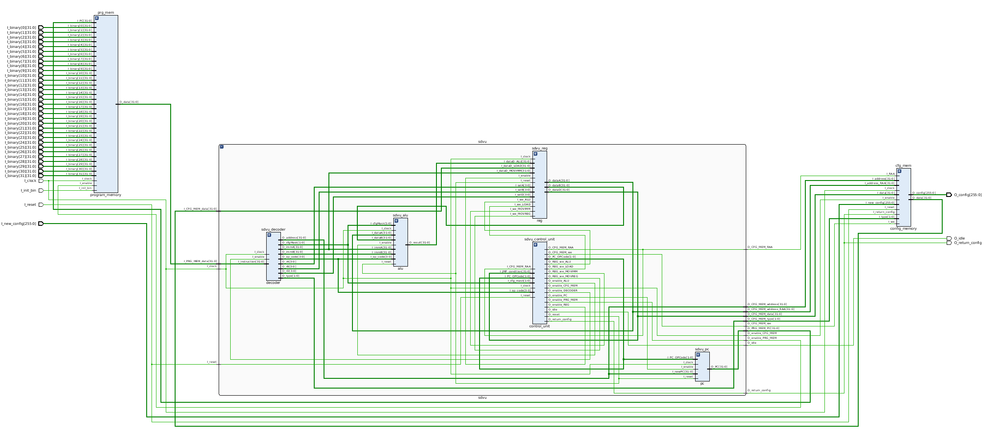
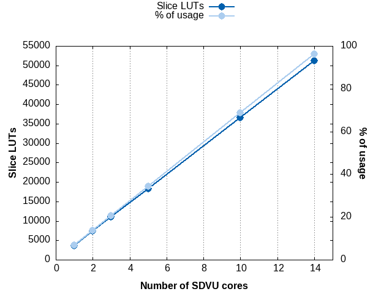

# Synthesis notes related to SDVU

## Synthesis results for a single SDVU core with its two memories - Vivado 2018.2 - Default settings

|        Site Type        | Used | Fixed | Available | Util% |
|-------------------------|------|--------|-----------|-------|
| Slice LUTs*             | 3597 |     0 |     53200 |  6.76 |
|   LUT as Logic          | 3597 |     0 |     53200 |  6.76 |
|   LUT as Memory         |    0 |     0 |     17400 |  0.00 |
| Slice Registers         | 2330 |     0 |    106400 |  2.19 |
|   Register as Flip Flop | 2074 |     0 |    106400 |  1.95 |
|   Register as Latch     |  256 |     0 |    106400 |  0.24 |
| F7 Muxes                |  194 |     0 |     26600 |  0.73 |
| F8 Muxes                |   97 |     0 |     13300 |  0.73 |

## How many SDVU cores can we fit on a Zedboard?

## Synthesis results for the SDVU CPU only

| Site Type | Used | Fixed | Available | Util% |
| --------- | ---- | ----- | --------- | ----- |
| Slice LUTs*             |  900 |     0 |     53200 |  1.69 |
|   LUT as Logic          |  900 |     0 |     53200 |  1.69 |
|   LUT as Memory         |    0 |     0 |     17400 |  0.00 |
| Slice Registers         |  755 |     0 |    106400 |  0.71 |
|   Register as Flip Flop |  755 |     0 |    106400 |  0.71 |
|   Register as Latch     |    0 |     0 |    106400 |  0.00 |
| F7 Muxes                |  192 |     0 |     26600 |  0.72 |
| F8 Muxes                |   96 |     0 |     13300 |  0.72 |
